# PU.1/GATA-1 Gene Regulatory Network Simulation

An interactive Streamlit application for simulating the **PU.1/GATA-1 gene regulatory network** that governs hematopoietic stem cell differentiation. The project implements and compares multiple numerical ODE solvers and machine learning approaches (PINN and Laplace Neural Operator), with built-in convergence analysis and benchmarking tools.

Based on the mathematical model from **Schiesser (2014), Chapter 5** — equations 5.1a and 5.1b.

---

## Abstract

The decision-making process of hematopoietic stem cells entering specific differentiation pathways is primarily governed by the mutually antagonistic transcription factors PU.1 and GATA-1. This project explores the mathematical modeling of this gene regulatory network using a system of ordinary differential equations (ODEs). While classical textbook approaches frequently rely on algebraic root-finding algorithms like Newton-Raphson to determine steady-state biological outcomes, our approach shifts the focus toward capturing the **transient, time-series dynamics** of the differentiation process. We simulate the system using a suite of explicit and implicit numerical ODE solvers, benchmarking them against a high-accuracy reference. Furthermore, we implement modern machine learning techniques, including a **Physics-Informed Neural Network (PINN)** and a **Laplace Neural Operator (LNO)**, to approximate the state trajectories.

---

## The Model

The system describes two competing transcription factors — **GATA-1 (G)** and **PU.1 (P)** — whose mutual inhibition and self-activation create a bistable switch that drives cell fate decisions:

$$\frac{dG}{dt} = \frac{a_1 G^n}{\theta_{a1}^n + G^n} + \frac{b_1 \theta_{b1}^m}{\theta_{b1}^m + G^m P^m} - k_1 G$$

$$\frac{dP}{dt} = \frac{a_2 P^n}{\theta_{a2}^n + P^n} + \frac{b_2 \theta_{b2}^m}{\theta_{b2}^m + G^m P^m} - k_2 P$$

Each equation has three distinct mechanisms:
- **Auto-activation** — positive feedback via Hill function
- **Basal production / cross-inhibition** — mutual suppression between G and P
- **Degradation** — linear protein decay

### Temporal Dynamics vs. Steady-State Root Finding

A critical distinction must be drawn between the approach used in Schiesser's textbook and the core methodology of this project. Schiesser primarily employs the **Newton-Raphson** root-finding method to determine the *steady states* of the system — setting dG/dt = 0 and dP/dt = 0 and solving the resulting non-linear algebraic system.

In contrast, our approach uses ODE solvers (both numerical and ML) to track the **transient time-series trajectory** of the proteins, mapping how the cell travels from an undifferentiated state (t=0) to its final differentiated state over time. The Newton-Raphson method is included for comparison and evaluated via its algebraic residual norms and tolerance sweeps.

---

## Features

### 1. System Dynamics

Solve the ODE system and visualize protein concentrations over time using any of the available methods:

| Method | Type | Order | Description |
|--------|------|-------|-------------|
| **Reference (SciPy)** | Adaptive | Variable | LSODA with automatic stiffness detection |
| **LSODA (Schiesser)** | Adaptive | Variable | Book's original R solver translated to Python, with 4-panel derivative analysis |
| **Euler's Method** | Explicit | 1st | Forward Euler — simplest time-stepping scheme |
| **Backward Euler** | Implicit | 1st | Implicit Euler with Newton iteration (via `fsolve`) |
| **Runge-Kutta (RK4)** | Explicit | 4th | Classical 4-stage method |
| **BDF** | Implicit | Multi-step | Backward differentiation formula for stiff systems |
| **Adams-Bashforth** | Explicit | Multi-step | 2-step method bootstrapped with RK4 |
| **Heun's Method** | Explicit | 2nd | Predictor-corrector (improved Euler) |

Each method has its own tab with configurable step size and automatic overlay of the SciPy reference solution. The **LSODA (Schiesser)** tab additionally provides the book's 4-panel derivative plot (G, P, dG/dt, dP/dt) and a numerical output table matching the original R console output.

### 2. Phase Plane & Steady States
- **Nullcline visualization** — curves where dG/dt = 0 and dP/dt = 0
- **Vector field** — streamlines showing system trajectories
- **Newton-Raphson root finder** — iteratively locates steady states with visual path tracking

### 3. Convergence Analysis
Compare solver accuracy using **relative L₂ error** against the SciPy reference:

- **Newton-Raphson**: Tolerance sweep (error vs. tolerance) and per-iteration relative error
- **ODE Solvers**: Step-size error (max relative error vs. *h*) and per-step error vs. time

All error metrics use the same relative L₂ formula: `||y_pred - y_ref||₂ / ||y_ref||₂`

### 4. Machine Learning

#### Physics-Informed Neural Network (PINN)
Train a neural network to learn G(t) and P(t) using the ODEs as physics constraints — **no labelled data required**:
- 3 hidden layers, 32 neurons per layer
- 1000 epochs, Adam optimizer (lr = 0.01)
- Decomposed loss: IC loss (weight 10.0) + physics residual (weight 1.0) over 200 collocation points
- Live training visualization with loss curves and prediction updates

#### Laplace Neural Operator (LNO)
A **data-driven** neural operator that maps initial conditions → full trajectories in the frequency domain:
- Trained on 200 pre-generated BDF trajectories
- 4 LNO blocks, d_model = 64, 32 Fourier modes
- 100 epochs (lr = 0.001, batch size 32)
- Instant inference (~1 ms) for any new initial condition after training

Both methods support GPU acceleration when available.

### 5. Benchmarking
A dedicated tab for head-to-head comparisons:

- **Numerical Methods**: Runs all implemented ODE solvers and overlays their relative L₂ error on two shared plots — step-size sweep and per-step error
- **Machine Learning**: Compares PINN vs. LNO against the reference. Auto-trains models if none exist

Both sub-tabs use the same relative L₂ error metric for consistent comparison.

---

## Simulation Results

### Baseline Trajectories

| Case 1 (Symmetric) | Case 2 (Asymmetric) |
|:---:|:---:|
| 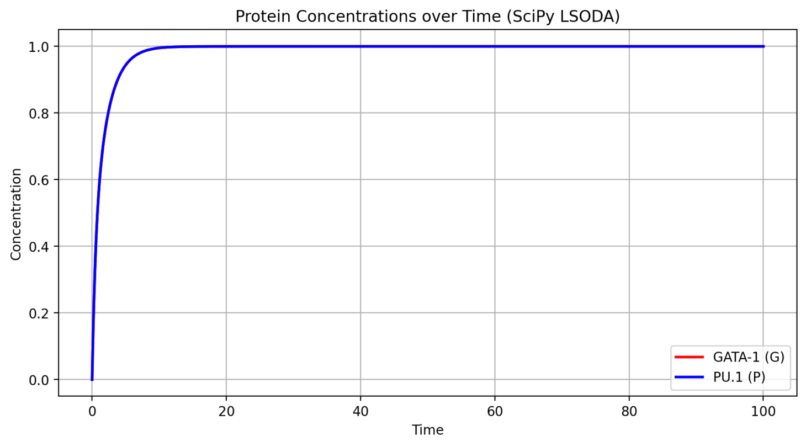 | 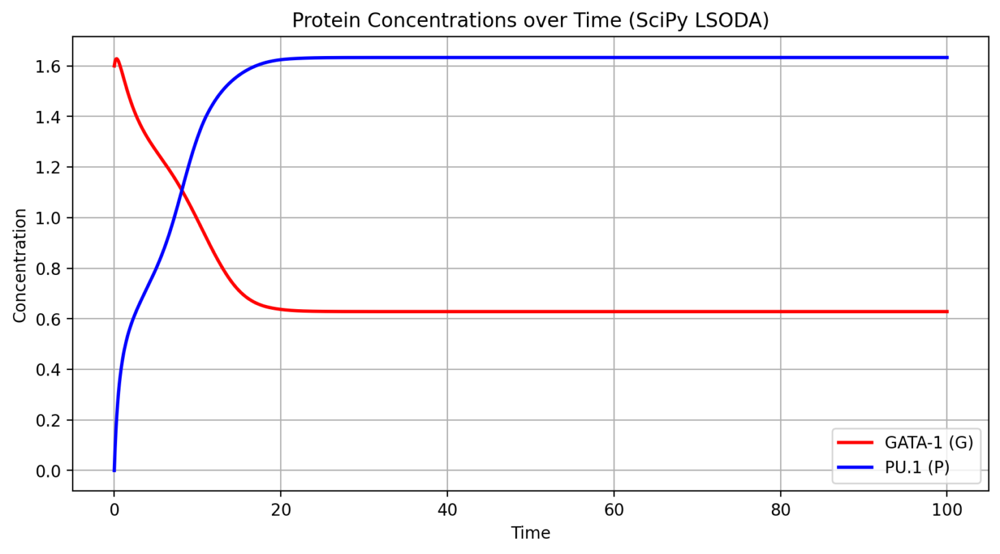 |

**Case 1** (all parameters = 1.0, G₀ = P₀ = 0): Both proteins rise symmetrically to equal steady-state concentrations.

**Case 2** (a₂ = 1.3, G₀ = 1.6, P₀ = 0): Despite elevated G₀, amplified a₂ causes PU.1 to rapidly auto-activate, suppressing GATA-1 and driving differentiation into the myeloid lineage.

### Numerical Method Error Analysis

#### Case 1 (Symmetric)

| Error vs Step Size | Per-Step Error (h = 0.1) |
|:---:|:---:|
| 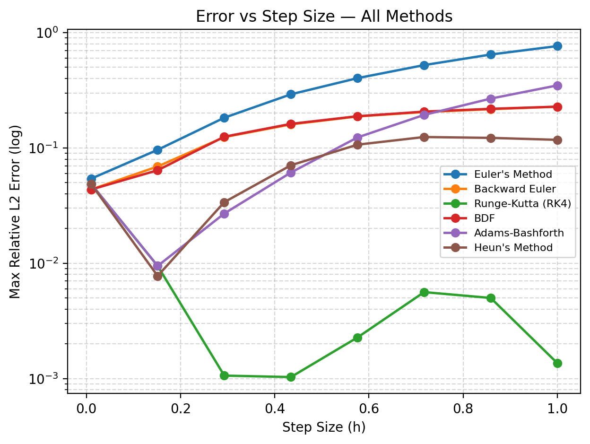 | 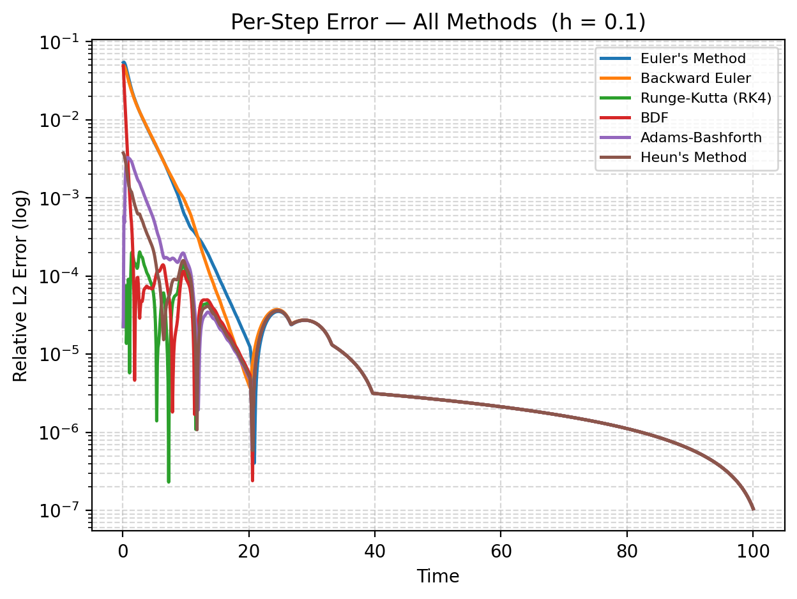 |

| Method | Max Rel. Error | Mean Rel. Error |
|--------|---------------|----------------|
| Euler's Method | 5.477 × 10⁻² | 1.106 × 10⁻³ |
| Backward Euler | 4.939 × 10⁻² | 1.058 × 10⁻³ |
| **Runge-Kutta (RK4)** | **2.040 × 10⁻⁴** | **1.588 × 10⁻⁵** |
| BDF | 4.939 × 10⁻² | 1.642 × 10⁻⁴ |
| Adams-Bashforth | 3.301 × 10⁻³ | 9.934 × 10⁻⁵ |
| Heun's Method | 3.764 × 10⁻³ | 6.153 × 10⁻⁵ |

#### Case 2 (Asymmetric)

| Error vs Step Size | Per-Step Error (h = 0.1) |
|:---:|:---:|
| 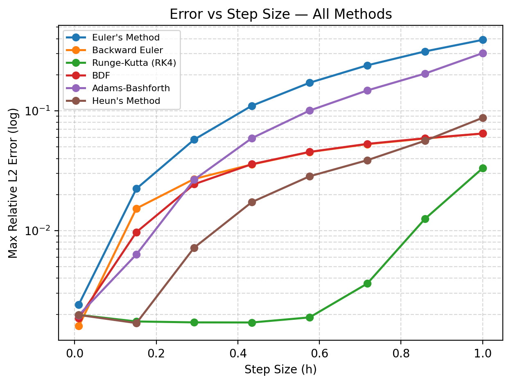 | 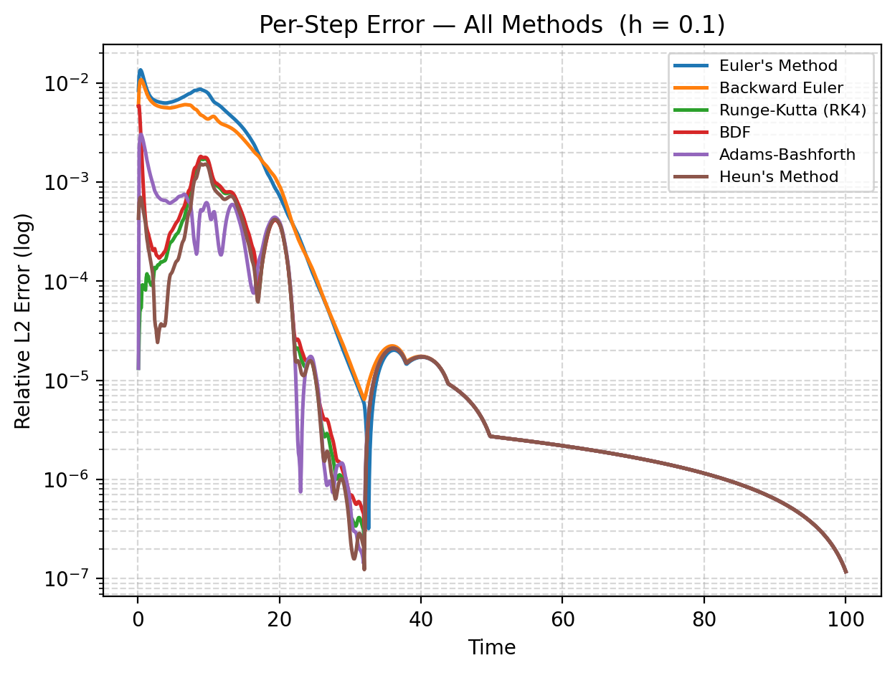 |

| Method | Max Rel. Error | Mean Rel. Error |
|--------|---------------|----------------|
| Euler's Method | 1.362 × 10⁻² | 1.153 × 10⁻³ |
| Backward Euler | 1.084 × 10⁻² | 9.092 × 10⁻⁴ |
| **Runge-Kutta (RK4)** | **1.742 × 10⁻³** | **1.165 × 10⁻⁴** |
| BDF | 5.908 × 10⁻³ | 1.537 × 10⁻⁴ |
| Adams-Bashforth | 3.036 × 10⁻³ | 1.275 × 10⁻⁴ |
| Heun's Method | 1.533 × 10⁻³ | 1.049 × 10⁻⁴ |

> **Key finding**: RK4 achieves the lowest errors at moderate step sizes. However, the step-size sweep reveals that explicit solvers degrade heavily as *h* increases (Euler's error approaches 10⁰), while implicit BDF scales more smoothly — a direct consequence of the system's stiffness.

### Machine Learning Performance

#### Case 1 (Symmetric)

| PINN Training & Prediction | LNO Training & Prediction |
|:---:|:---:|
| 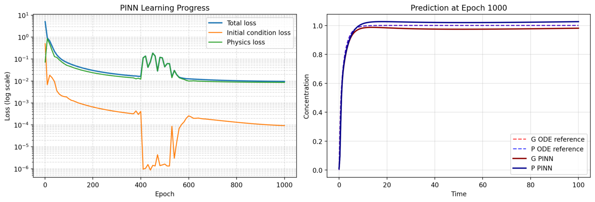 | 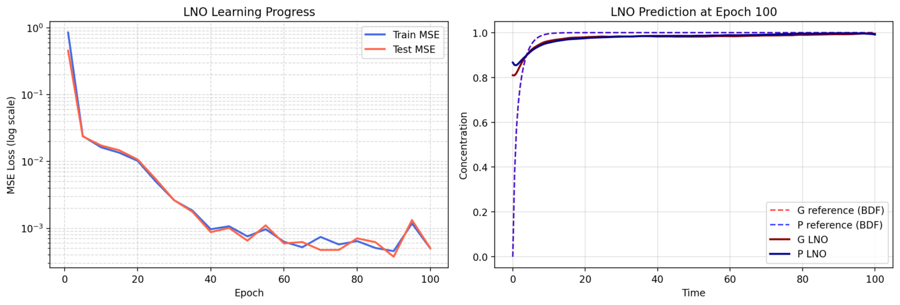 |

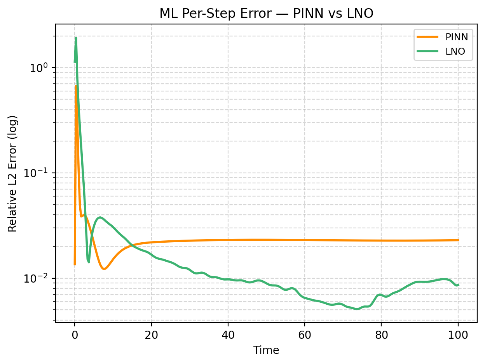

#### Case 2 (Asymmetric)

| PINN Training & Prediction | LNO Training & Prediction |
|:---:|:---:|
| 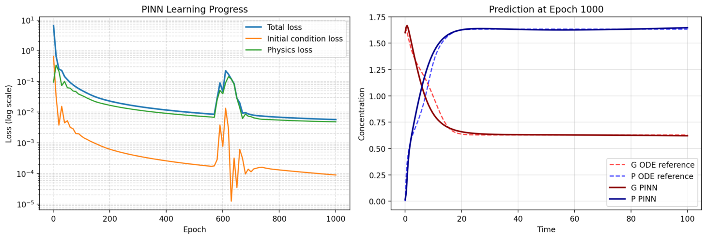 | 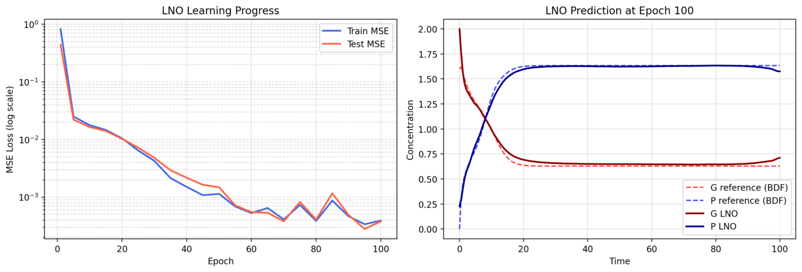 |

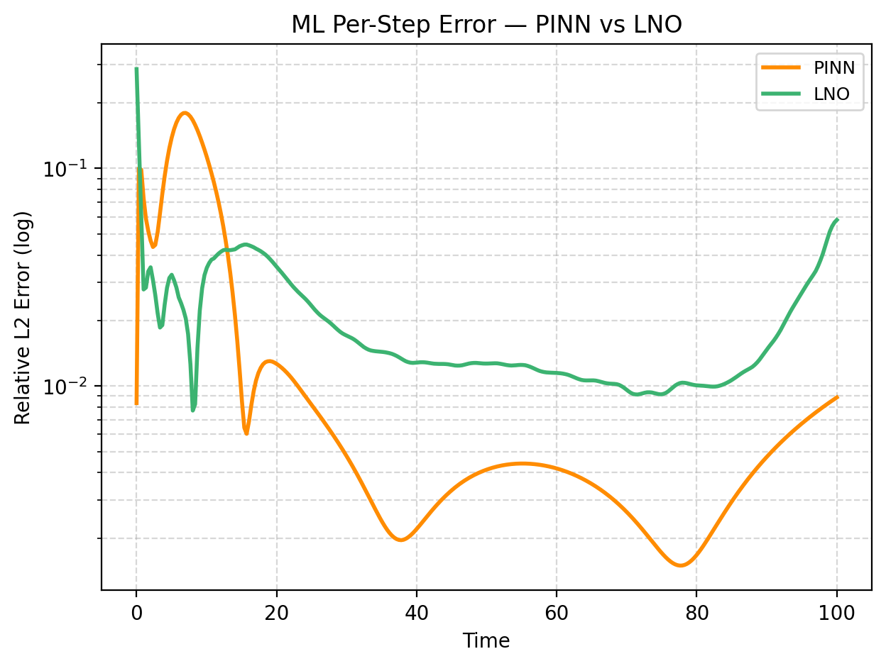

> **Key findings**:
> - In Case 1, the PINN stabilizes at ~2 × 10⁻² error while the LNO converges below 10⁻² after an initial spike
> - In Case 2, the PINN exhibits oscillatory errors (10⁻³ to 10⁻²) characteristic of gradient-conflict in stiff optimization, while the LNO maintains smoother ~10⁻² error with slight upward drift at the domain boundary
> - The LNO performs instant inference (~1 ms) after training, making it practical for rapid parameter exploration

---

## Project Structure

```
├── app.py                             # Streamlit UI (5 tabs + subtabs)
├── requirements.txt
├── CONTRIBUTING.md                    # Guide for adding new solvers
├── assets/                            # Result figures for documentation
│
└── solvers/
    ├── core.py                        # Shared ODE system equations
    │
    ├── numerical/
    │   ├── __init__.py                # Solver registry (ODE_SOLVERS list)
    │   ├── registry.py                # Auto-discovery of solver modules
    │   ├── newton/solver.py           # Newton-Raphson root finder
    │   ├── euler/solver.py            # Forward Euler
    │   ├── backward_euler/solver.py   # Implicit Euler (fsolve)
    │   ├── runge_kutta/solver.py      # Classical RK4
    │   ├── bdf/solver.py              # Backward Differentiation Formula
    │   ├── adams_bashforth/solver.py  # Adams-Bashforth (AB2, RK4 bootstrap)
    │   └── heun/solver.py             # Heun's method (improved Euler)
    │
    └── ml/
        ├── pinn/
        │   ├── model.py               # PINN architecture (nn.Module)
        │   ├── loss.py                # Physics-informed loss functions
        │   └── utils.py               # Evaluation & visualization
        │
        └── lno/
            ├── model.py               # LNO architecture (frequency-domain blocks)
            ├── data.py                # BDF trajectory generation & normalization
            ├── training.py            # Training loop & inference
            └── utils.py               # Visualization helpers
```

### Architecture

The app is designed around two registry patterns:

**Numerical solvers** expose a uniform interface:
```python
def solve(ode_func, t_span, y0, args, dt) -> (t, y)
```
The UI iterates over the `ODE_SOLVERS` list in `solvers/numerical/__init__.py` to generate tabs and convergence analysis automatically. Adding a new solver requires zero changes to `app.py` — see [CONTRIBUTING.md](CONTRIBUTING.md).

**ML solvers** are organized as sub-packages under `solvers/ml/`, each with their own model, training, and utility modules.

**Shared error metric** — a single `_relative_l2_error()` function is used across convergence analysis and benchmarking for consistent comparison between all methods.

---

## Getting Started

### Prerequisites

- Python 3.9+
- pip

### Installation

```bash
git clone https://github.com/Noureldin-Islam-2006/Stem-Cells-Differentiation-Project.git
cd Stem-Cells-Differentiation-Project
pip install -r requirements.txt
```

### Running

```bash
streamlit run app.py
```

The app will open in your browser at `http://localhost:8501`.

### Parameter Presets

Two built-in presets from the textbook:
- **Case 1 (Symmetric)** — stable progenitor state, both proteins converge to equal concentrations
- **Case 2 (Asymmetric)** — bistable switch, small perturbations drive differentiation toward one lineage

All 12 model parameters are individually adjustable via the sidebar.

---

## Future Work

- **Adaptive step-size methods** (e.g., RK4(5) Fehlberg) to automatically contract steps during rapid differentiation phases
- **Dynamic loss balancing** for the PINN to prevent IC loss gradients from overpowering physics residuals
- **Parameter-conditioned LNO** — feed varying (a₁, a₂) into the latent space for parameter-agnostic instant inference
- **Stochastic models** — extend beyond deterministic ODEs to stochastic branching processes reflecting cell-state continuums

---

## Contributing

See [CONTRIBUTING.md](CONTRIBUTING.md) for instructions on adding new numerical or ML solvers. The short version:

1. Implement `solve()` in `solvers/numerical/<method>/solver.py`
2. Set `IS_IMPLEMENTED = True`
3. The UI picks it up automatically — no changes to `app.py` needed

---

## References

- Schiesser, W. E. (2014). *Differential Equation Analysis in Biomedical Science and Engineering: Ordinary Differential Equation Applications with R*. Chapter 5: Stem Cell Differentiation.
- Glauche, I. & Marr, C. (2021). Mechanistic models of blood cell fate decisions in the era of single-cell data. *Current Opinion in Systems Biology*, 28, 100355.
- Handzlik, J. E. & Manu (2022). Data-driven modeling predicts gene regulatory network dynamics during the differentiation of multipotential hematopoietic progenitors. *PLOS Computational Biology*, 18(1), e1009779.
- MacArthur, B. D. & Greulich, P. (2024). Self-renewal without niche instruction, feedback or fine-tuning. *bioRxiv preprint*.
